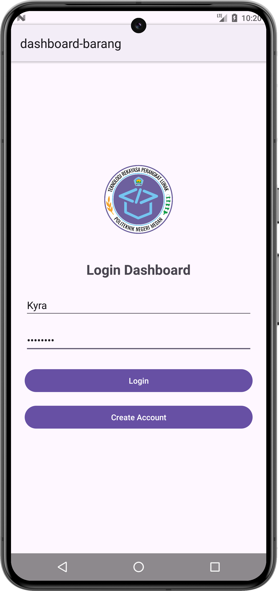
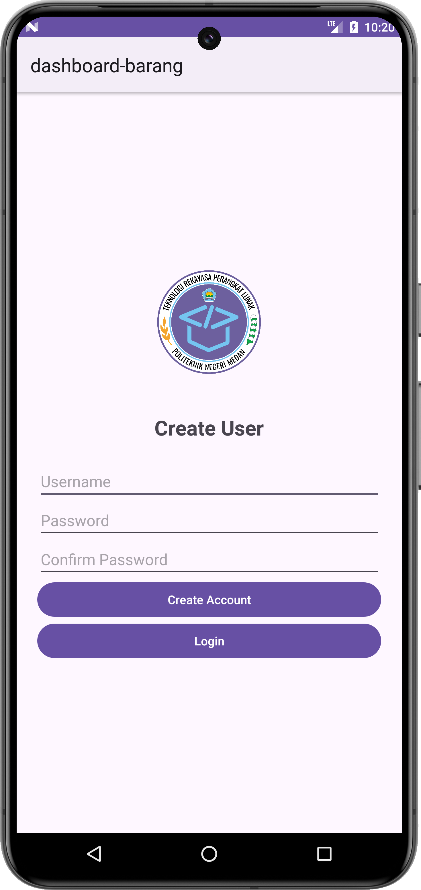
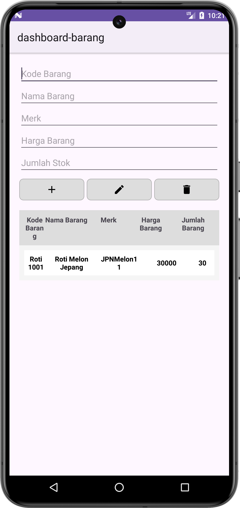
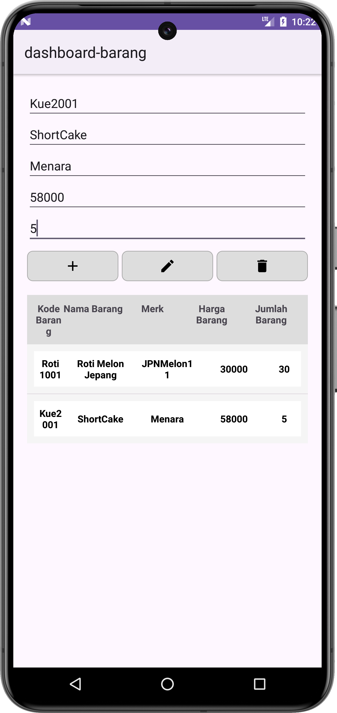
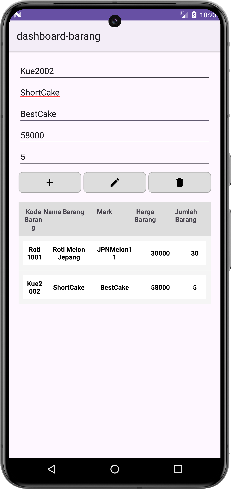
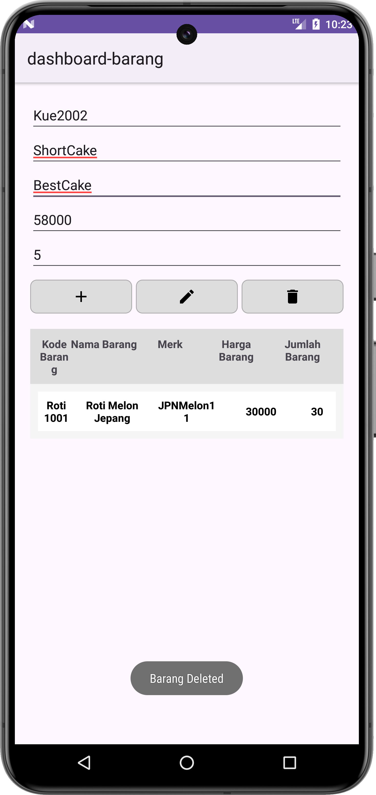

# college-android-barang
This is an app for login and register to store data in SQLite using CRUD.

**Primary Language**: Java

## Overview

Android Barang is an Android application designed as part of a college project. The app utilizes SQLite for local data storage and focuses primarily on user authentication and barang management. Currently, the application includes a functional login and register feature and the ability to add, delete, edit and update. Additional features are under development.

## Screenshots

  
*Icon Screen*

  
*Login Screen*

  
*Register Screen*

  
*Dashboard Screen*

  
*Add Features*

  
*Update Features*

  
*Delete Features*


## Features

 **User Registration**: Users can register by providing a username and password.
- **Login**: Registered users can log in using their credentials.
- **CRUD for Barang (Items)**: Users can perform CRUD operations on `barang`:
  - **Create**: Add a new item to the inventory.
  - **Read**: View all items in the inventory.
  - **Update**: Edit existing item details.
  - **Delete**: Remove an item from the inventory.

## Technologies Used

- **Android Studio**: Integrated Development Environment (IDE) for Android app development.
- **Java**: Programming language used for developing the application.
- **XML**: Markup language for designing user interfaces.
- **SQLite**: Lightweight database used for local data storage.

## Code Structure

- **Java**: Contains the logic for handling login validation and volume calculation.
  - `LoginActivity.java`: Handles user login.
  - `RegisterActivity.java`: Handles user register.
  - `DashboardActivity.java`: Contains the code for logic add barang, update barang and delete barang.
  - `DatabaseHelper.java`: Contains the code for CRUD logic on SQlite.
  -    
- **XML**: Defines the UI layout.
  - `activity_login.xml`: Layout for the login screen.
  - `activity_register.xml`: Layout for the register screen.
  - `activity_dashboard.xml`: Layout for the Dashboard, contains user input to add data, update data, delete data.
  - `barang_list_item.xml` : Layout for the list of barang data.

## Getting Started

### Prerequisites
- **Android Studio**: Ensure Android Studio is installed and for me, i'm using Android Studio Koala | 2024.1.1 Patch 2.
- **Java Development Kit (JDK)**: Version 8 or above and for me, i'm using Version 17.0.11.

## Installation

**Clone the repository**:
1. Clone this repository to your local machine.
   ```bash
   git clone https://github.com/yourusername/loginApp.git
   
Replace `yourusername/your-repo-name` in the `git clone` command with your actual GitHub repository name, and update any screenshot paths if you add them. This README covers the project's main details and provides context for users or reviewers.

2. Launch Android Studio and select "Open an existing Android Studio project".
3. Navigate to the cloned repository folder and open it.
4. Build the project: Click on "Build" in the top menu and select "Make Project".
5. Connect an Android device or start an emulator.
6. Click on the "Run" button in Android Studio.
7. Username: testUser Password: testPass | Username: Kyra Password: admin123
# college-android-barang
